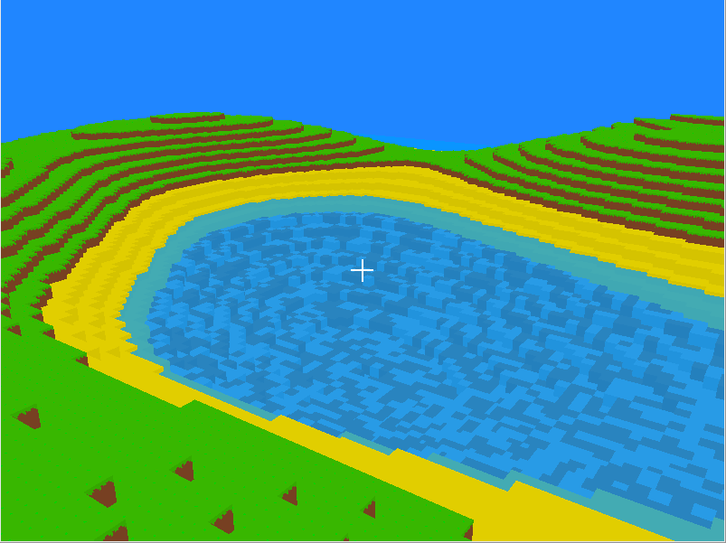
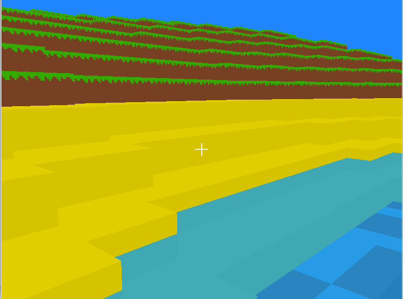

# voxel-world

This is a simple 3D voxel simulation based on OpenGL. It includes the following:
- Multithreaded mesh generation
- Simple infinite procedural world generation
- Adding/removing blocks
- Various rendering optimizations such as face culling and adding/deleting of vertices as needed

# Screenshots

# Building

A binary compiled on Linux Mint 21.3 x86-64 is included among the project files for convenience.
The application can also be built from source. It requires the following libraries:
- [GLAD](https://glad.dav1d.de/) (Headers only, a glad.c file is included among the project files)
- [GLFW](https://www.glfw.org/)
- [Glm](https://github.com/g-truc/glm)
- [FastNoiseLite](https://github.com/Auburn/FastNoiseLite)
- [readerwriterqueue](https://github.com/cameron314/readerwriterqueue)
- [stb_image](https://github.com/nothings/stb/blob/master/stb_image.h)

Then the included makefile can be used, though it assumes that the libraries are installed in a systemwide include directory. 
If not, it may need to be altered to include the paths where the include and binary files were installed.
